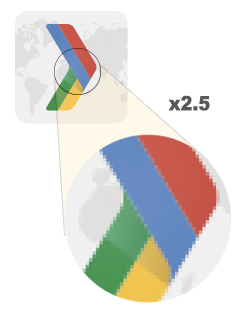
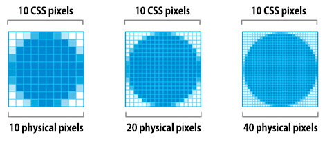
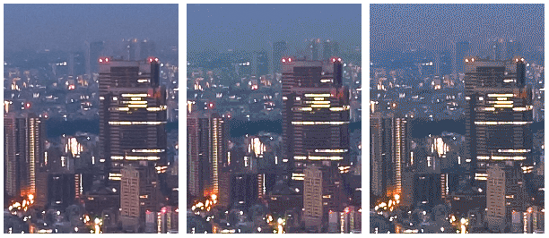

# 1.Web前端优化-资源优化.md

## 1.1 删除不必要的资源下载
1. 确保网站引用的第三方资源，有足够优秀的性能表现；
2. 评估网站引用的第三方资源，有充分的价值；
3. 删除不必要的或i性能低下的第三方资源；

## 1.2 优化编码和压缩基于文本的资源大小

### 1.2.1 数据压缩101

#### 1.2.2 压缩：预处理&上下文最佳化（Minification: preprocessing & context-specific optimizations）

#### 1.2.3 使用GZIP压缩文本

## 1.3 图片优化
大部分情况下，图片是占用网站流量最多的Web资源，同时占据着网页很大部分视觉区域。如果能在不影响图片质量的前提下，减少图片占用的流量，将极大地改善网站用户体验。可以从以下几个方面对图片进行优化：

### 1.3.1 剔除或使用其他手段代替图片
1. 剔除不必要的图片资源；
2. 尽量使用CSS等手段代替图片资源；
3. 使用Web Fontt代替图片中艺术字（主要针对英文字体）；

### 1.3.2 矢量图（Vector Image） vs 光栅图（Raster Image）
1. 矢量图是几何形状图片的理想载体；
2. 矢量图是缩放和分辨率无关，能更好地适应不同的尺寸和分辨率，而光栅图则需要使用不同的尺寸适应缩放和不同分辨率；
3. 矢量图通过点、线和多边形来绘制图片；
4. 光栅图通过读取二进制文件来绘制每个像素点；
5. 可以用SVG绘制简单的矢量图，而复杂的图形则使用图片展示；

   **矢量图和光栅图缩放对比**  

### 1.3.3 图片对高分辨率屏幕的影响
1. 高分辨率下，多个设备像素对应一个CSS像素；
2. 高分辨率下，为了不影响质量，光栅图需要更多的像素点和字节；

**不同DPI下，设备像素和CSS像素的对比效果**



因此，要在高分辨率屏幕下展示高质量的图片效果，光栅图则需要占用更大的字节数，而矢量图则没有这个问题。在允许的情况下，尽量使用矢量图代替光栅图。

### 1.3.4 优化矢量图（Vector Image）
1. SVG是一个基于XML的矢量图格式；
2. SVG可以通过压缩XML来最小化大小（svgo工具）；
3. SVG可以通过GZIP进行压缩（Web服务器启动GZIP压缩）；

下面是一个矢量图的XML格式

```xml
<?xml version="1.0" encoding="utf-8"?>
<!-- Generator: Adobe Illustrator 17.1.0, SVG Export Plug-In . SVG Version: 6.00 Build 0)  -->
<svg version="1.2" baseProfile="tiny" id="Layer_1" xmlns="http://www.w3.org/2000/svg" xmlns:xlink="http://www.w3.org/1999/xlink"
   x="0px" y="0px" viewBox="0 0 612 792" xml:space="preserve">
<g id="XMLID_1_">
  <g>
    <circle fill="red" stroke="black" stroke-width="2" stroke-miterlimit="10" cx="50" cy="50" r="40"/>
  </g>
</g>
</svg>
```

### 1.3.5 优化光栅图（Raster Image）
1. 光栅图实际上是一个像素网格；
2. 每个像素包含了颜色和透明度信息；
3. 图片压缩技术采用了各种各样的技术来减少每个像素点需要的字节从而减少图片的大小；

一个光栅图实际上是由一个二维网格的像素点组成的，例如一个100x100像素的图片，实际上是10000个序列像素点。同时，每个像素点都保存了各自的RGBA通道的值。在浏览器中，图片的每个通道都有256个取值范围（0-255），浏览器会为每个通道分配1个字节内存空间对通道数据进行存储。因此，在内存中，每个像素点会占有4字节的空间。我们可以通过图片的分辨率来计算图片占用的内存空间，以100x100像素的图片为例：

1. 100 x 100px图片包含10000个像素点；
2. 10000像素点 x 4 bytes = 40000 bytes；
3. 40,000 bytes / 1024 = 39 KB

`题外话：在浏览器内部，每个像素点都会占用4个字节的内存空间，所以，当图片越大，占用的内存越多，所以我们需要考虑在移动平台下当图片过大导致内存不够用的问题；`

图片的每个通道占用一个字节空间，有256个取值范围，RGB三个通道共计有16,777,216个取值范围，而这里的很大部分颜色范围，是很难通过人的眼睛区分的。所以优化光栅图的办法就是如何在尽量保证图片质量的情况下，压缩RGBA的取值范围，甚至是删除通道（例如不透明图片可以删除Alpha通道）。

下面这张png图片分别使用 32-bit、7-bit、5-bit进行色值压缩，而表现效果相差并非十分明显。



1. 人的眼睛很难区分相邻的色值，例如（125,125,125）和(120,120,120);
2. 我们可以采用取相邻色值的方法来了代替压缩后没有的色值范围；
3. 而有些图片，在PS阶段就没有采用很多的色值，如果采用32bit保存，其实是非常浪费的；

### 1.3.6 无损压缩（Lossless Compression） vs 有损压缩（Lossy Compression）

1. 由于人眼无法区分严格区分相邻色值，采用有损压缩其实也是个很好的办法；
2. 图片的压缩优化，其实就是对图片进行有损压缩或无损压缩；
3. 图片格式的区别在于采取的无损压缩或有损压缩算法的区别；
4. 并没有但一的最佳优化方案，针对不同情况采取不同的压缩策略才是硬道理；
5. 有损压缩在于减少通道的取值范围，例如 16bit，8bit的图片；
6. 无损压缩在于压缩像素数据，类似与压缩工具的效果；
7. 最有效的压缩方案就是根绝图片的内容选择有损或无损压缩；

### 1.3.7 选择合适的图片格式

1. 首先选择合适的通用格式：GIF、PNG、JPEG;
2. 对每种格式图片的调色板、质量进行优化设置；
3. 考虑使用WebP和JPEG XR这些现代浏览器支持的格式；

除了有损压缩和无损压缩的算法不同外，不同格式的图片也有不同的特性，例如支持/不支持动画，是否有Alpha通道。下面这张表格列出了不同格式的图片对这些特性的支持：

图片格式|透明通道|动画|浏览器支持
-------|-------|----|--------
GIF    | 支持  |支持 |所有
PNG    | 支持  |不支持|所有
JPEG   |不支持 |不支持|所有
JPEG XR|支持|支持|IE
WebP   |支持|支持|Chrome、Opera等

如果你想要图片支持动画，那么GIF是目前最优的选择；如果不想要动画，但需要透明，则可以选择PNG；如果两者都不需要，则使用JPEG;

### 1.3.8 图片优化清单

1. 优先使用矢量图；
2. 使用GZIP压缩矢量图；
3. 选择最优的光栅图格式；
4. 调节光栅图调色板使图片质量最优化；
5. 删除不必要的图片元数据；
6. 图片尽可能的使用原尺寸，切莫拉伸图片分辨率，优先使用浏览器拉伸图片大小；
7. 使用自动化工具优化图片；

## 1.4 Web Font优化

### 1.4.1 剖析WebFont

#### 1.4.1.1 WebFont格式

#### 1.4.1.2 压缩Webfont大小

### 1.4.2 通过@font-face定义字体家族

#### 1.4.2.1 字体格式选择

#### 1.4.2.2 Unicode-range subsetting

#### 1.4.2.3 Font selection and synthesis

### 1.4.3 优化加载和渲染

### 1.4.4 优化清单

## 1.5 HTTP缓存

### 1.5.1 通过Etag验证响应缓存


### 1.5.2 Cache-Control

#### 1.5.2.1 "no-cache" and "no-store"

#### 1.5.2.2 "public" vs. "private"

#### 1.5.2.3 "max-age"

### 1.5.3 定义最佳的HTTP缓存策略 

#### 1.5.3.1 废除和更新缓存响应

#### 1.5.3.2 缓存清单