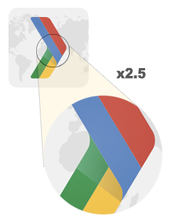

# 1.Web前端优化-资源优化.md

## 1.1 删除不必要的资源下载
1. 确保网站引用的第三方资源，有足够优秀的性能表现；
2. 评估网站引用的第三方资源，有充分的价值；
3. 删除不必要的或i性能低下的第三方资源；

## 1.2 Optimizing Encoding and Transfer Size of Text-Based Assets

## 1.3 图片优化
大部分情况下，图片是占用网站流量最多的Web资源，同时占据着网页很大部分视觉区域。如果能在不影响图片质量的前提下，减少图片占用的流量，将极大地改善网站用户体验。可以从以下几个方面对图片进行优化：

### 1.3.1 剔除或使用其他手段代替图片
1. 剔除不必要的图片资源；
2. 尽量使用CSS等手段代替图片资源；
3. 使用Web Fontt代替图片中艺术字（主要针对英文字体）；

### 1.3.2 矢量图（Vector Image） vs 光栅图（Raster Image）
1. 矢量图是几何形状图片的理想载体；
2. 矢量图是缩放和分辨率无关，能更好地适应不同的尺寸和分辨率，而光栅图则需要使用不同的尺寸适应缩放和不同分辨率；
3. 矢量图通过点、线和多边形来绘制图片；
4. 光栅图通过读取二进制文件来绘制每个像素点；
5. 可以用SVG绘制简单的矢量图，而复杂的图形则使用图片展示；

   **矢量图和光栅图缩放对比**  

### 1.3.3 Implications of high-resolution screens

### 1.3.4 Optimizing vector images

### 1.3.5 Optimizing raster images

### 1.3.6 Lossless vs lossy image compression

### 1.3.7 Selecting the right image format

### 1.3.8 Tools and parameter tuning

### 1.3.9 Delivering scaled image assets

### 1.3.10 Image optimization checklist

## 1.4 Web Font优化

### 1.4.1 Anatomy of a webfont

### 1.4.2 Defining font family with @font-face

### 1.4.3 Optimizing loading and rendering

### 1.4.4 Optimization checklist

## 1.5 HTTP缓存

### 1.5.1 Validating cached responses with ETags

### 1.5.2 Cache-Control

### 1.5.3 Defining optimal Cache-Control policy 

### 1.5.4 Invalidating and updating cached responses

### 1.5.5 Caching checklist
