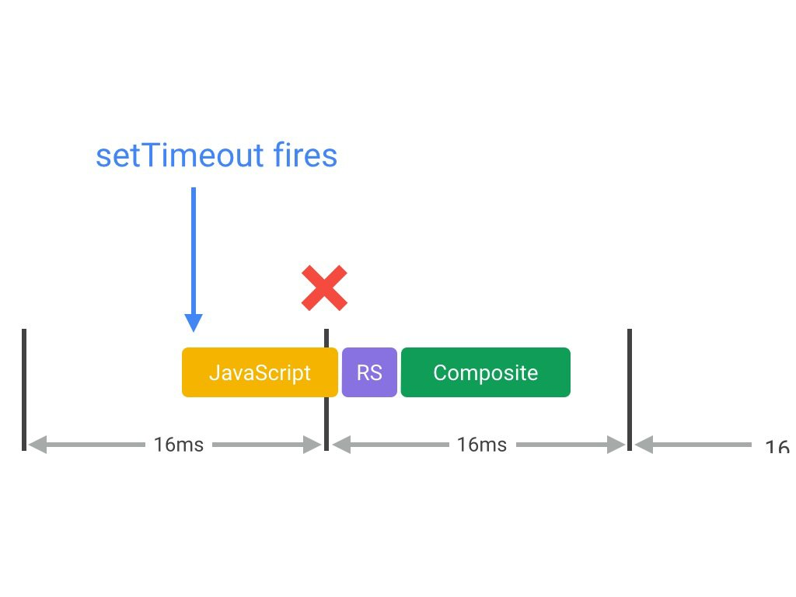
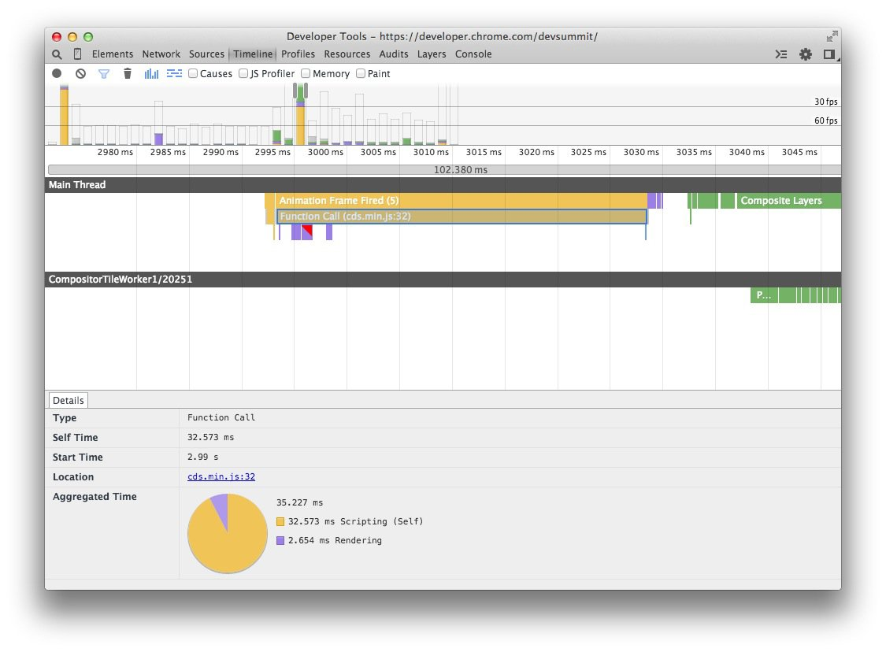
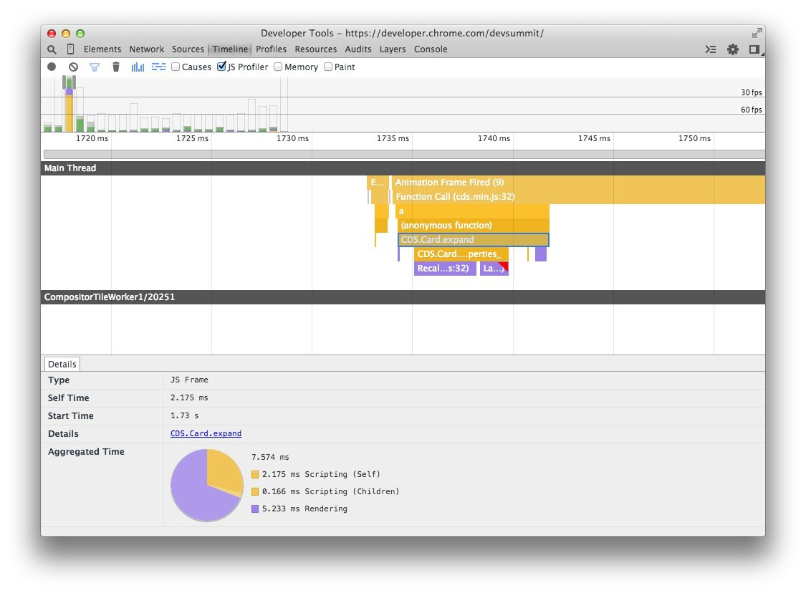

#2.Web前端优化-渲染优化

##2.1 概览

要编写高性能的Web网站或App，你需要了解HTML、JavaScript和CSS在浏览器中是怎么运行的，这样你才能保证你写的代码或者引出的第三方库能够高效地运行。

###2.1.1 60fps和设备刷新频率

现在大部分设备屏幕的刷新频率都是60帧每秒。如果浏览器中有播放动画或者用户滚动页面，浏览器需要根据屏幕刷新频率并绘制一张图片来适应屏幕的刷新。

以60fps为例，每一帧大概花费60毫秒（1s/60=16.66ms）。除去浏览器自身内部开销，我们大概会有10毫秒的时间来处理页面内容。如果我们处理页面的时间远远超过这些时间，页面就会给人一种顿卡的糟糕体验。

###2.1.2 像素管道（The pixel pipeline）

你需要注意以下五个方面的内容：


* **JavaScript:** Typically JavaScript is used to handle work that will result in visual changes, whether it’s jQuery’s animate function, sorting a data set, or adding DOM elements to the page. It doesn’t have to be JavaScript that triggers a visual change, though: CSS Animations, Transitions, and the Web Animations API are also commonly used.
* **Style calulations:** This is the process of figuring out which CSS rules apply to which elements based on matching selectors, for example, .headline or .nav > .nav__item. From there, once rules are known, they are applied and the final styles for each element are calculated.
* **Layout:** Once the browser knows which rules apply to an element it can begin to calculate how much space it takes up and where it is on screen. The web’s layout model means that one element can affect others, for example the width of the <body> element typically affects its children’s widths and so on all the way up and down the tree, so the process can be quite involved for the browser.
* **Paint:** Painting is the process of filling in pixels. It involves drawing out text, colors, images, borders, and shadows, essentially every visual part of the elements. The drawing is typically done onto multiple surfaces, often called layers.
* **Compositing:** Since the parts of the page were drawn into potentially multiple layers they need to be drawn to the screen in the correct order so that the page renders correctly. This is especially important for elements that overlap another, since a mistake could result in one element appearing over the top of another incorrectly.

上面这个五个方面都可能会使页面产生顿卡现象，所以我们要非常熟悉我们编写的代码对这五个管道的影响。

有时，我们在讨论绘图的时候，经常会听到“光栅化（rasterize）”这个名词。这是因为绘图实际包含两个任务：1、创建draw call；2、填充像素。后者整个步骤，我们称之为光栅化。所以，当你在开发者中看到绘图（painting）时，其中包含光栅化这个过程。

在开发或者debug过程中，我们没必要每次都关注每帧各个管道的细节。实际上，当我们触发页面视觉变化时，通常都是JavaScript、CSS和Web交互动画引起的。

**1. JavaScript / CSS > Style > Layout > Paint > Composite**


当我们改变layout属性时，通常都是有某个元素的几何形状被修改了，例如width、height、position、left或top等。这时，浏览器需要去检测其他所有元素并**reflow（重排）**页面。所有被影响的区域将要被**repaint（重绘）**，最后将所有绘制要的元素重新组合。

**2. JavaScript / CSS > Style > Composite**


当我们仅修改了“（paint）绘制”相关的属性，例如backgroud-img、text-color或者阴影等这不会引起页面布局变化的属性，浏览器会跳过layout这个阶段。

**3. JS / CSS > Style > Composite**


如果我们修改的属性不会引起重排和重绘，浏览器会直接跳到组合阶段。这种是性能消耗最低的，同时也是我们在页面生命周期中极力追求的目标。

**如果想知道css哪些样式会/不会引起重排或者重绘，可以查阅[https://developers.google.com/web/fundamentals/performance/rendering/stick-to-compositor-only-properties-and-manage-layer-count](https://developers.google.com/web/fundamentals/performance/rendering/stick-to-compositor-only-properties-and-manage-layer-count)**

优化是逃避的艺术，同时尽可能地让你的代码最优化。上面这些我们应紧记心中。

###2.1.3 浏览器渲染优化

[免费教程](https://udacity.com/ud860)

##2.2 优化JavaScript执行

JavaScript经常会触发页面的视觉变化。有时会通过操作样式导致页面变化，有时JavaScript的计算操作也会导致页面变化，例如搜索或排序数据。占用CPU资源长或长时间中的JavaScript经常会成为页面的性能问题。所以，我们应该可能对其进行优化。

JavaScript的性能分析是一门艺术，因为JavaScript的最终执行并不一定跟我们写的代码一直。现代浏览器会通过JIT和一些优化技巧尽量地去优化代码，这会改变我们代码。

但不管怎么样，我们也可以通过一些明确的手段优化我们的JavaScript。

* 避免使用`setTimeout`和`setInterval`来更新页面视觉，可以通过requestAnimationFrame进行更新操作；
* 把长时间执行的JavaScript从主线程移到Web Worker中去；
* Use micro-tasks to make DOM changes over several frames；
* Use Chrome DevTools’ Timeline and JavaScript Profiler to assess the impact of JavaScript；

###2.2.1 使用`requestAnimationFrame`进行视觉更新操作

当页面视觉想要产生变化时，我们要做的就是在适当的时间去执行更新视觉变化的代码，而这个时间点最好就是在帧开始时。而`requestAnimationFrame`就为我们提供了这个保证。它可以保证我们代码可以在帧开始时执行。

```JavaScript
/**
 * If run as a requestAnimationFrame callback, this
 * will be run at the start of the frame.
 */
function updateScreen(time) {
  // Make visual updates here.
}

requestAnimationFrame(updateScreen);
```

很多框架都会使用`setTimeout`和`setInterval`去执行页面视觉更新的代码。问题就在于这两个函数执行的时间点是确定的，他们可能在帧内的任意一个时间点执行，最坏的情况下就是帧尾执行，会产生严重的顿卡现象。



实际上，jQuery默认使用`setTimeout`来执行动画，我们强烈通过[https://github.com/gnarf/jquery-requestAnimationFrame](https://github.com/gnarf/jquery-requestAnimationFrame)来改变默认行为。

###2.2.2 降低JavaScript工作的复杂度，或者使用Web Worker来执行JavaScript

在浏览器中，JavaScript和样式计算、布局、甚至和绘制一样，都是在主线程执行的，如果JavaScript占用过多的时间，会导致其他工作阻塞，甚至会产生丢帧的情况。

所以我们必须对JavaScript的啥时候运行，以及运行多长时间做到心中有数。

同时，我们可以纯计算的复杂脚本交给Web Worker处理。例如数据操作和遍历，想排序或者搜索等，非常适合交给Web Worker处理。

```JavaScript
var dataSortWorker = new Worker("sort-worker.js");
dataSortWorker.postMesssage(dataToSort);

// The main thread is now free to continue working on other things...

dataSortWorker.addEventListener('message', function(evt) {
   var sortedData = evt.data;
   // Update data on screen...
});
```

Not all work can fit this model: Web Workers do not have DOM access. Where your work must be on the main thread, consider a batching approach, where you segment the larger task into micro-tasks, each taking no longer than a few milliseconds, and run inside of requestAnimationFrame handlers across each frame.

```JavaScript
var taskList = breakBigTaskIntoMicroTasks(monsterTaskList);
requestAnimationFrame(processTaskList);

function processTaskList(taskStartTime) {
  var taskFinishTime;

  do {
    // Assume the next task is pushed onto a stack.
    var nextTask = taskList.pop();

    // Process nextTask.
    processTask(nextTask);

    // Go again if there’s enough time to do the next task.
    taskFinishTime = window.performance.now();
  } while (taskFinishTime - taskStartTime < 3);

  if (taskList.length > 0)
    requestAnimationFrame(processTaskList);

}
```

There are UX and UI consequences to this approach, and you will need to ensure that the user knows that a task is being processed, either by using a progress or activity indicator. In any case this approach will keep your app's main thread free, helping it to stay responsive to user interactions.

###2.2.3 评估JavaScript的帧消耗

When assessing a framework, library, or your own code, it’s important to assess how much it costs to run the JavaScript code on a frame-by-frame basis. This is especially important when doing performance-critical animation work like transitioning or scrolling.

The best way to measure your JavaScript’s cost and performance profile is to use Chrome DevTools. Typically you will get low detail records that look like this:



If you discover that you have long-running JavaScript, you can enable the JavaScript profiler at the top of the DevTools user interface:


There is an overhead to profiling JavaScript in this way, so be sure to only enable it when you want more insight into JavaScript runtime characteristics. With the checkbox enabled you can now perform the same actions and you’ll get significantly more information on which functions were called in your JavaScript:



Armed with this information you can assess the performance impact of the JavaScript on your application, and begin to find and fix any hotspots where functions are taking too long to execute. As mentioned earlier you should seek to either remove long-running JavaScript, or, if that’s not possible, move it to a Web Worker freeing up the main thread to continue on with other tasks.

###2.2.4 Avoid micro-optimizing your JavaScript

It may be cool to know that the browser can execute one version of a thing 100 times faster than another thing, like that requesting and element’s offsetTop is faster than computing getBoundingClientRect(), but it’s almost always true that you’ll only be calling functions like these a small number of times per frame, so it’s normally wasted effort to focus on this aspect of JavaScript’s performance. You'll typically only save fractions of milliseconds.

If you’re making a game, or a computationally expensive application, then you’re likely an exception to this guidance, as you’ll be typically fitting a lot of computation into a single frame, and in that case everything helps.

In short, you should be very wary of micro-optimizations because they won’t typically map to the kind of application you’re building.

##2.3 减少样式范围和复杂的样式计算

###2.3.1 Reduce the complexity of your selectors

###2.3.2 Reduce the number of elements being styled

###2.3.3 Measure your Style Recalculation Cost

###2.3.4 Use Block, Element, Modifier

###2.3.5 Resources

##2.4 避免大、复杂的布局和布局抖动

##2.5 简化绘制的复杂性和减少绘制区域

##2.6 Stick to Compositor-Only Properties and Manage Layer Count

##2.7 Debounce Your Input Handlers
