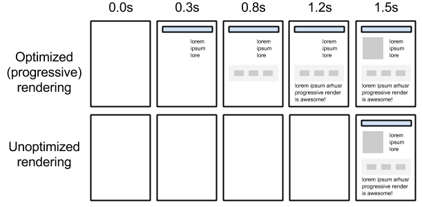
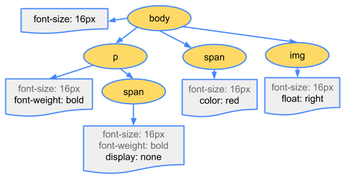

#3. Web前端优化-渲染路径

##3.1 构造对象模型

###3.1.1 文档对象模型（DOM）

###3.1.2 CSS对象模型（CSSOM）

##3.2 渲染书构造，排版和绘制

##3.3 渲染阻塞CSS

##3.4 使用JavaScript添加交互

###3.4.1 Parser blocking versus asynchronous JavaScript

##3.5 测量渲染路径

##3.6 分析关键渲染路径性能

##3.7 优化渲染路径

##3.8 PageSpeed规则和建议

###3.8.1 消除对渲染阻塞的JavaScript和CSS

###3.8.2 优化JavaScript的使用方式

####3.8.2.1 优先使用异步的JavaScript资源

####3.8.2.2 避免同步的服务器调用

####3.8.2.3 推迟解析JavaScript

####3.8.2.4 避免长时间执行的JavaScript

###3.8.3 优化CSS的使用方式

####3.8.3.1 把CSS放文档head中

####3.8.3.2 避免CSS import指令

####3.8.2.3 使用内联CSS